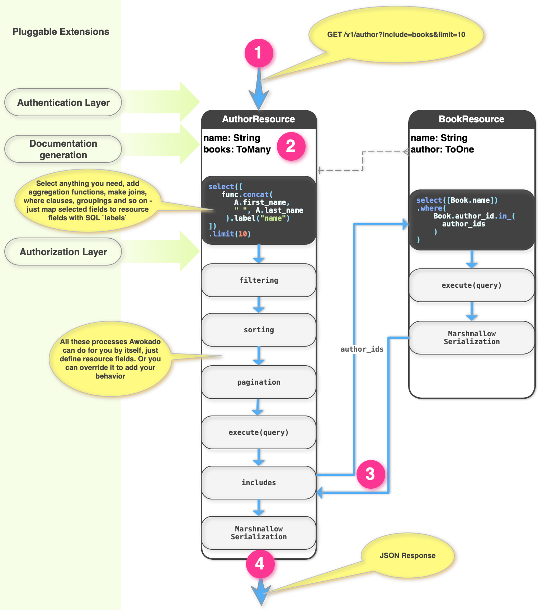

.. awokado documentation master file, created by
   sphinx-quickstart on Fri Jul 19 11:01:57 2019.
   You can adapt this file completely to your liking, but it should at least
   contain the root `toctree` directive.

Welcome to awokado's documentation!
***********************************

Fast and flexible low-level API framework based on Falcon, Marshmallow and SQLAlchemy Core
API is close to OpenAPI 3.0 specification

.. toctree::
   :maxdepth: 2
   :caption: Contents:

*Indices and tables*
=====================

* :ref:`genindex`
* :ref:`modindex`
* :ref:`search`

awokado resource
------------------

.. code-block:: python
   :linenos:

   from typing import List

   import sqlalchemy as sa
   from marshmallow import fields

   import tests.test_app.models as m
   from awokado import custom_fields
   from awokado.consts import CREATE, READ, UPDATE
   from awokado.utils import ReadContext
   from tests.test_app.resources.base import Resource

   class BookResource(Resource):
    class Meta:
        model = m.Book
        name = "book"
        methods = (CREATE, READ, UPDATE)
        auth = None

    id = fields.Int(model_field=m.Book.id)
    title = fields.String(model_field=m.Book.title, required=True)
    description = fields.String(model_field=m.Book.description)
    author = custom_fields.ToOne(
        resource="author", model_field=m.Book.author_id
    )

    def get_by_author_ids(
        self, session, ctx: ReadContext, field: sa.Column = None
    ):
        authors = sa.func.array_remove(
            sa.func.array_agg(m.Author.id), None
        ).label("authors")
        q = (
            sa.select(
                [
                    m.Book.id.label("id"),
                    m.Book.title.label("title"),
                    m.Book.description.label("description"),
                    m.Book.store_id.label("store"),
                    authors,
                ]
            )
            .select_from(
                sa.outerjoin(m.Book, m.Author, m.Author.id == m.Book.author_id)
            )
            .where(m.Book.author_id.in_(ctx.obj_ids))
            .group_by(m.Book.id)
        )
        result = session.execute(q).fetchall()
        serialized_objs = self.dump(result, many=True)
        return serialized_objs

.. automodule:: awokado.resource
    :members:

